# 后台管理系统的前端代码生成工具
后台管理系统的很多页面的逻辑是类似的。因此，可以抽象出一系列规则配置，通过配置来生成页面。详细介绍可以见下面的功能。

该工具能生成项目 [admin-template](https://github.com/iamjoel/front-end-template/tree/master/admin) 的列表，新增，编辑，详情页。

## 启动
1 安装服务器依赖
```
cd server
npm install
```

2 创建表
本项目需要 MySQL。数据库 Schema 文件地址 : `server/schema.sql`。

拷贝 `server` 目录下的 `/config-demo`，重命名为 `config`。数据库配置文件地址: `server/config/database.js`。

3 安装客户端依赖
```
cd www
npm install
```

4 启动
```
npm start
```


## 功能
### 配置角色
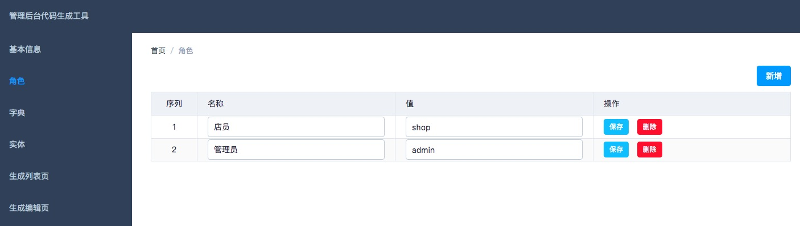

### 配置字典
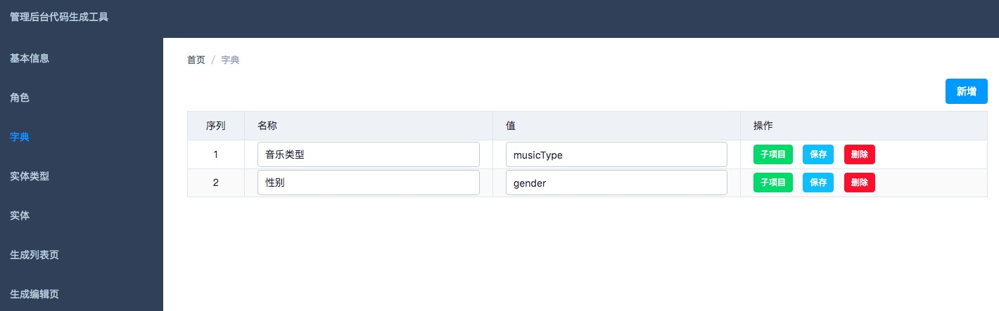

字典子项  
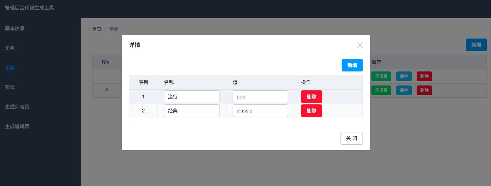

### 配置实体
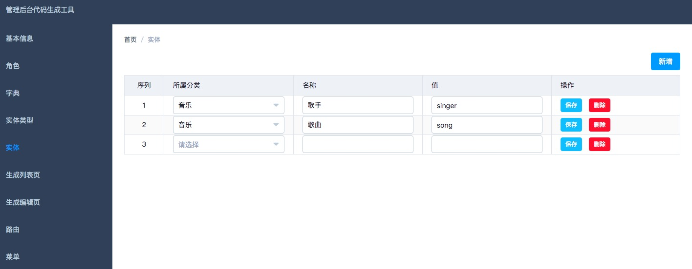

### 配置列表页
支持将配置同步到指定文件夹。在展开的代码上，写自己的代码。若已修改过展开的代码。可以冻结该条数据，避免误操作，覆盖代码。
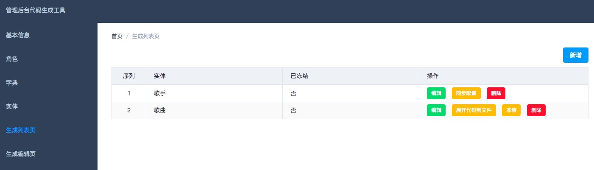

配置基础信息  
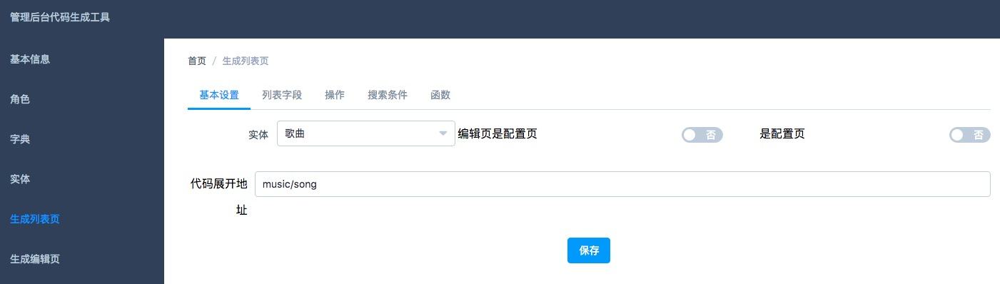
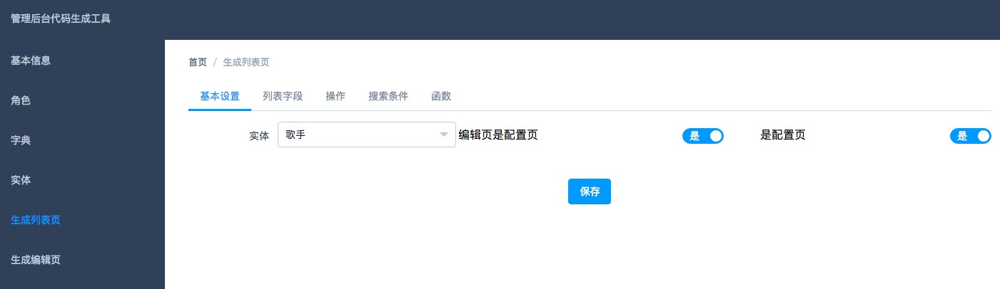

配置列表字段  
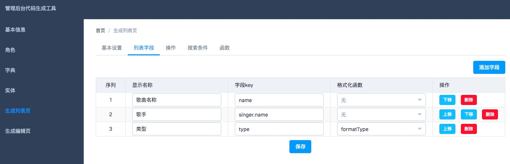

配置操作  
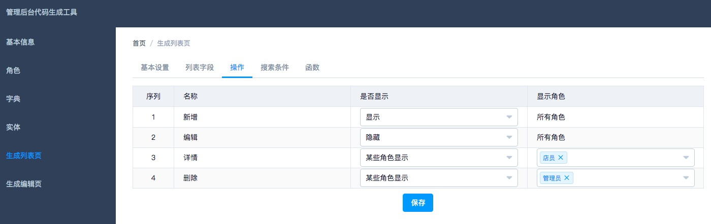

配置搜索条件  
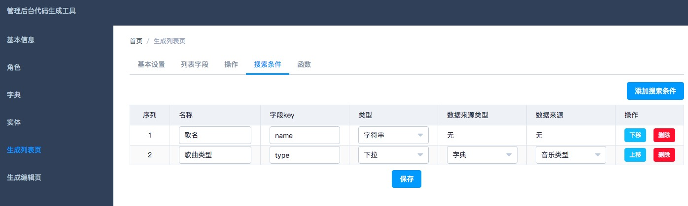

配置函数  
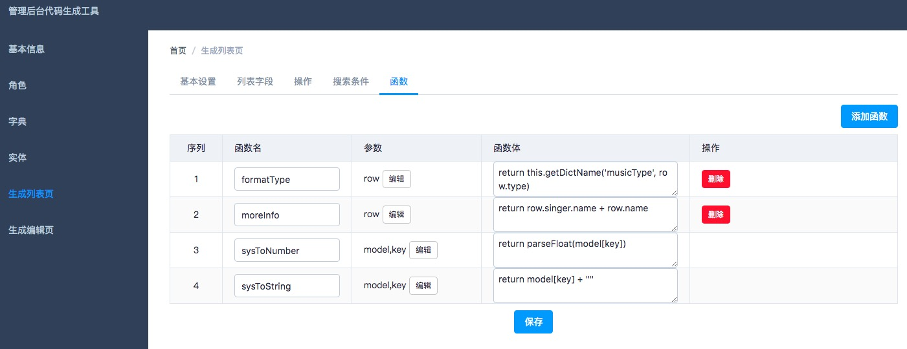

### 配置新增，编辑，详情页
支持将配置同步到指定文件夹。在展开的代码上，写自己的代码。若已修改过展开的代码。可以冻结该条数据，避免误操作，覆盖代码。


配置列表字段  
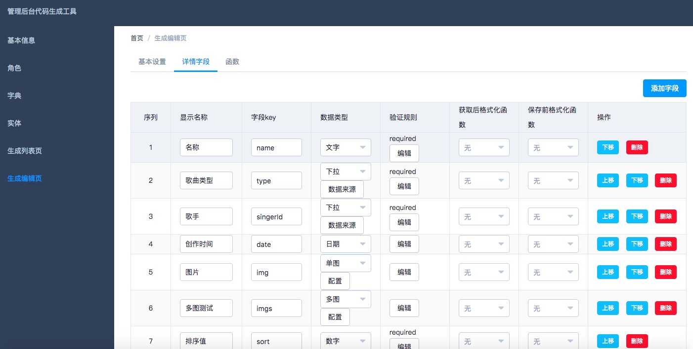


## 基本配置
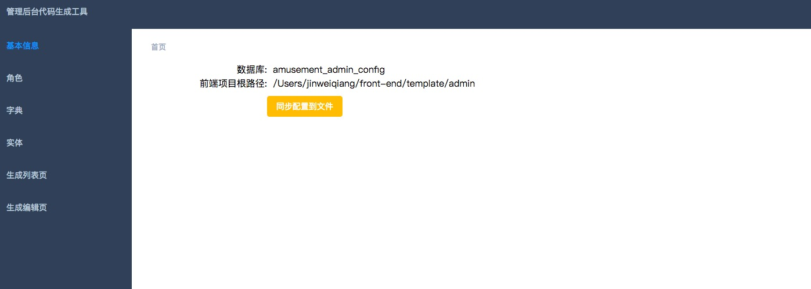

## TODO
* 将配置反向同步到数据库？是否需要该功能。
* 路由和菜单同步到项目。项目也将路由和菜单分开。
* 列表，详情使用 mock数据的配置。
* mock 登录帐号。


