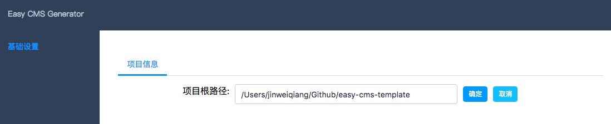
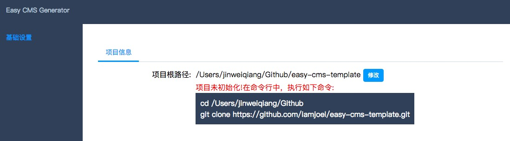
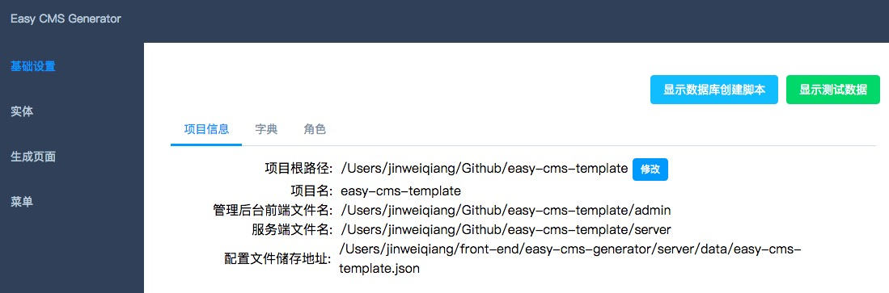
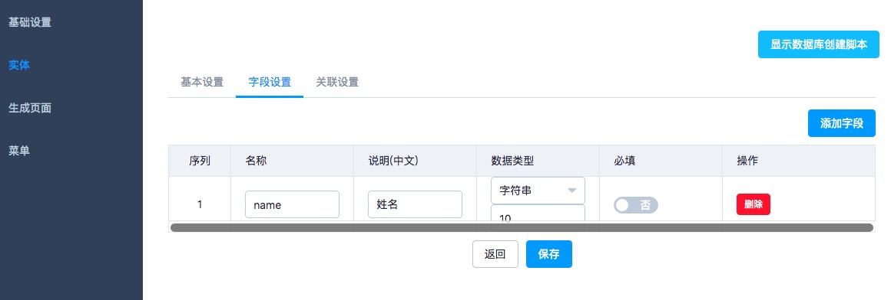

# Easy CMS Generator
通过页面的可视化操作，生成 CMS 的服务端接口与管理后台代码。

## 特点
* **易用**。页面操作，无须编码。
* **安全**。生成代码和非生成代码在不同文件夹。无须担心生成代码覆盖。
* **灵活**。如需改动生成的代码，在对应界面，按弹出按钮，会将生成的代码移动到非生成代码文件夹。
* **易维护**。生成的代码可读性强，易于维护。

## 功能
* 生成 数据库创建脚本。
* 生成 测试数据的数据库脚本。
* 生成 服务器端 CRUD 代码。用的是 MySQL。支持:
  * 单表。
  * 表关联。
    * 一对一。
    * 一对多。
* 生成 管理后台的前端 列表和更新页。包括：
  * 前端路由
  * 左侧菜单
  * 前端字典
  * 角色

## 4 步做一组页面
1 输入项目地址  


2 生成项目的初始化结构  


根据上图的提示做对应的命令。命令运行完后刷新页面，会出现类似下图的结果。



3 新增实体  




4 用数据库创建脚本创建数据库


测试数据


## 启动
1 安装服务器依赖  
```
cd server
npm install
npm -g i nodemon
```

2 安装客户端依赖  
```
cd www
npm install
```

3 启动  
```
npm start
```


