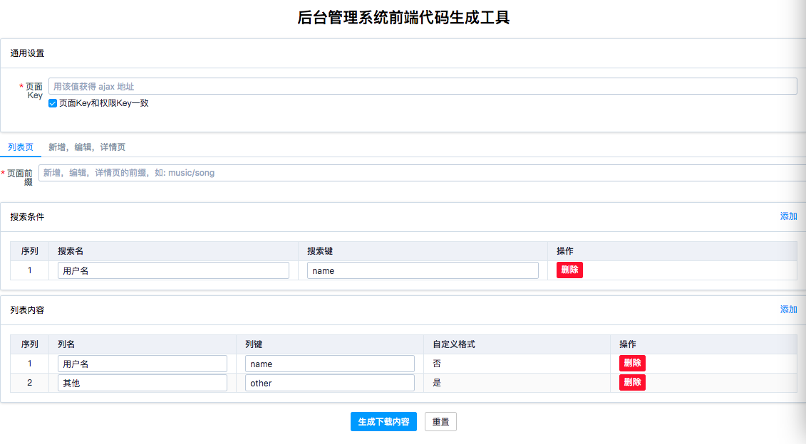
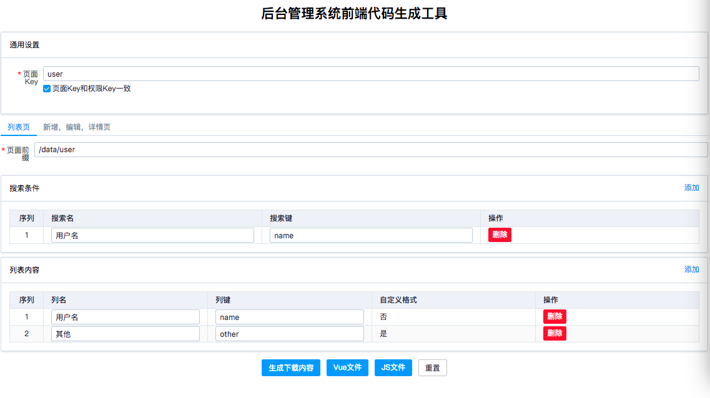
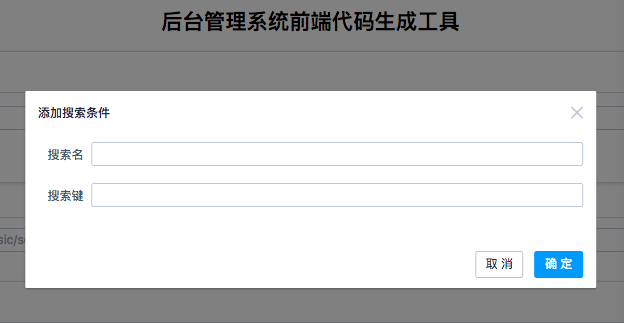
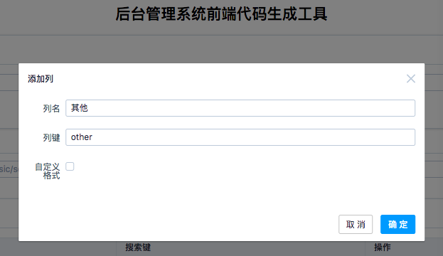
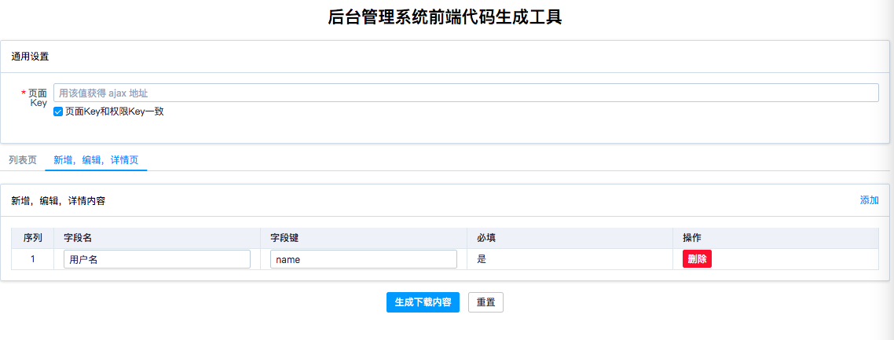

# 管理后台前端代码生产工具
该工具是为项目 [admin-template](https://github.com/iamjoel/admin-template) 做的。能生成，列表，新增，编辑，详情页。 演示见[这里](https://iamjoel.github.io/admin-fe-generator/src/)。

## 内容截图
### 生成列表页

### 下载

  

### 添加搜索条件

  

### 添加列

  

### 生成新增，编辑，详情页

  

