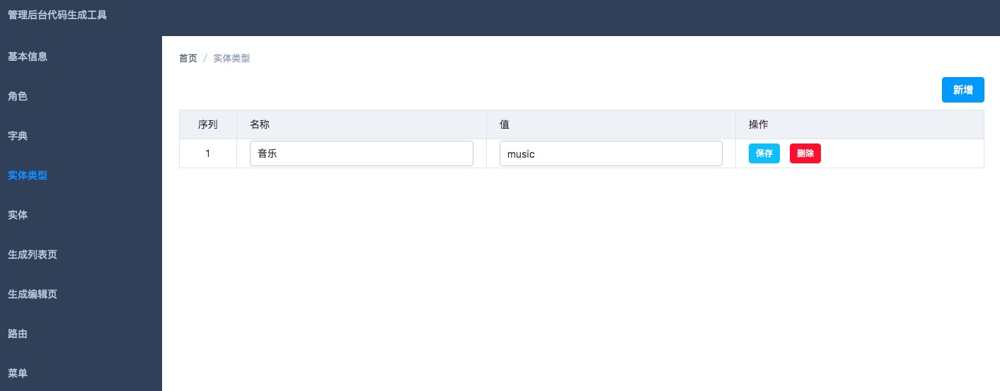
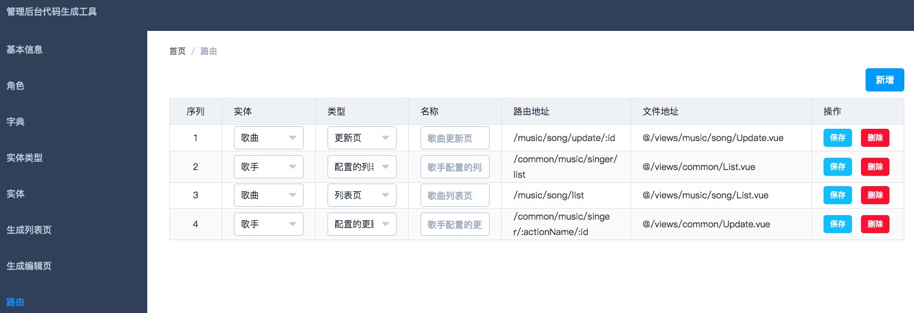
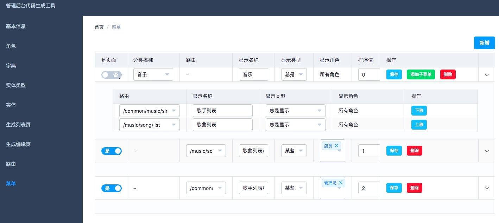

# 后台管理系统的前端代码生成工具
后台管理系统的很多页面的逻辑是类似的。因此，可以抽象出一系列规则配置，通过配置来生成页面。详细介绍可以见下面的功能。

该工具能生成项目 [admin-template](https://github.com/iamjoel/front-end-template/tree/master/admin) 的列表，新增，编辑，详情页。

## 启动
1 安装服务器依赖  
```
cd server
npm install
npm -g i nodemon
```

2 创建表表文件  
在 `server/data/` 下创建一个 `json` 文件，内容拷贝 `server/data/db.schema.json`。

3 安装客户端依赖  
```
cd www
npm install
```

4 启动  
```
npm start
```

## 制作流程
1. 创建基础数据。
  1. 新建实体。实体可以理解为一个对象。一般实体对应数据库中的一张表。
  1. 新建实体类型[可选]。
1. 创建页面。
  1. 创建列表页。
  1. 创建编辑页。编辑页包括 新增，编辑，详情页。
1. 创建路由和菜单
  1. 创建路由。
  1. 创建菜单。只支持两级菜单。一级菜单可以是分类或页面。二级菜单一定是页面。分类来自实体类型，页面数据来自路由。

## 功能
### 配置角色


### 配置字典


字典子项  


### 配置实体类型


### 配置实体


### 配置列表页
支持将配置同步到指定文件夹。在展开的代码上，写自己的代码。若已修改过展开的代码。可以冻结该条数据，避免误操作，覆盖代码。


配置基础信息  


配置列表字段  


配置操作  


配置搜索条件  


配置函数  


### 配置新增，编辑，详情页
支持将配置同步到指定文件夹。在展开的代码上，写自己的代码。若已修改过展开的代码。可以冻结该条数据，避免误操作，覆盖代码。


配置列表字段  


## 配置路由


## 配置菜单


## 基本配置

